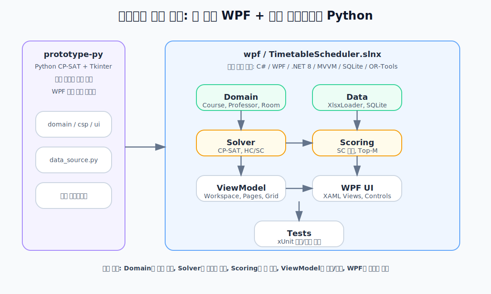
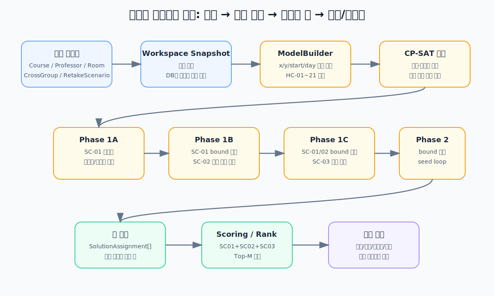
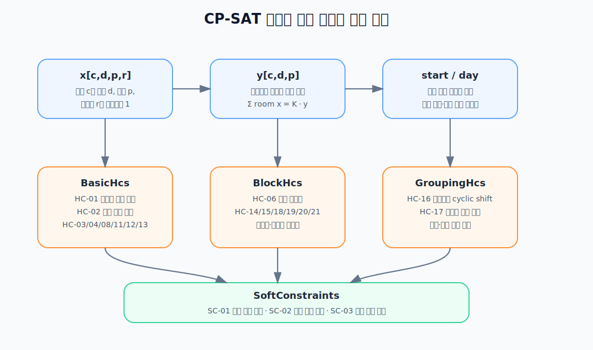

# 프로젝트 내부 구조 설명서

이 문서는 전공 시간표 자동 편성 프로젝트를 다른 사람에게 설명할 때 사용할 수 있도록, 실제 코드 구조를 기준으로 내부 동작을 정리한 자료입니다. 특히 현재 본 제품인 WPF 구현과 시간표 자동생성 엔진의 구조를 중심으로 설명합니다.



## 1. 전체 구조 한눈에 보기

저장소는 크게 두 구현으로 나뉩니다.

| 위치 | 역할 | 현재 의미 |
|---|---|---|
| `prototype-py/` | Python + Tkinter 프로토타입 | 초기 CSP 설계와 회귀 베이스라인 |
| `wpf/` | C# / WPF 본 제품 | 현재 개발·포팅 대상 |
| `docs/` | 설계 문서와 UI 목업 | 발표·공유·구현 계획 자료 |

현재 설명의 중심은 `wpf/TimetableScheduler.slnx`입니다. Python 프로토타입은 “이전 구현이 어떻게 동작했는지”를 확인하는 기준이고, 실제 앱 구조와 UI는 WPF 쪽에 모여 있습니다.

## 2. WPF 솔루션의 계층

WPF 구현은 여러 프로젝트로 나뉘어 있으며, 각 프로젝트는 한 가지 책임을 갖습니다.

| 프로젝트 | 핵심 역할 | 대표 파일 |
|---|---|---|
| `TimetableScheduler.Domain` | 순수 도메인 모델 | `Course.cs`, `Professor.cs`, `Room.cs`, `DomainHelpers.cs` |
| `TimetableScheduler.Data` | xlsx 로딩, SQLite 저장, 저장된 시간표 관리 | `XlsxLoader.cs`, `SqliteRepository.cs`, `AppData.cs` |
| `TimetableScheduler.Solver` | OR-Tools CP-SAT 모델 생성, HC/SC 적용, 해 탐색 | `ModelBuilder.cs`, `DiverseSolver.cs`, `BasicHcs.cs`, `BlockHcs.cs`, `GroupingHcs.cs`, `SoftConstraints.cs` |
| `TimetableScheduler.Scoring` | 생성된 해의 SC 점수 계산과 랭킹 | `SolutionScoring.cs` |
| `TimetableScheduler.ViewModel` | 화면과 로직 사이의 상태·명령 계층 | `WorkspaceService.cs`, `SolverService.cs`, `Pages/*`, `Grid/*` |
| `TimetableScheduler.Wpf` | 실제 WPF XAML 화면과 컨트롤 | `Views/*`, `Controls/*`, `App.xaml` |
| `TimetableScheduler.Tests` | 단위·통합·회귀 테스트 | `Solver/*`, `Integration/*`, `ViewModel/*` |

핵심 설계 원칙은 **Domain을 중심에 두고, 화면과 저장소와 솔버를 분리하는 것**입니다. 시간표 생성 로직은 WPF 화면에 직접 묶이지 않고, `SolverService`와 `DiverseSolver`를 통해 호출됩니다.

## 3. 데이터가 흐르는 방식

사용자가 보는 흐름은 다음과 같습니다.

1. xlsx 편람을 가져오거나 DB에 저장된 데이터를 불러옵니다.
2. `WorkspaceService`가 현재 과목·교수·강의실·교차수강·재수강 조건을 들고 있습니다.
3. 자동생성 버튼을 누르면 `SolverService`가 현재 Workspace를 스냅샷으로 복사합니다.
4. `DiverseSolver`가 스냅샷을 기준으로 시간표 후보를 여러 개 생성합니다.
5. `SolutionScoring`이 후보별 SC 점수를 계산하고 Top-M으로 정렬합니다.
6. `ResultsViewModel`이 결과를 통합/학년/강의실/교수별 시간표로 렌더링합니다.
7. 사용자는 결과를 수동 편집 화면으로 넘기고, 편집 결과를 저장할 수 있습니다.

중요한 점은 솔버가 직접 DB를 수정하지 않는다는 것입니다. 솔버는 `WorkspaceService.SchedulingSnapshot()`으로 복사·정규화한 입력만 보고 계산하며, 결과는 `SolutionAssignment` 목록으로 반환합니다.

## 4. 자동생성 엔진 구조



자동생성 엔진의 핵심 파일은 `wpf/TimetableScheduler.Solver` 아래에 있습니다.

| 파일 | 역할 |
|---|---|
| `Constants.cs` | 요일 수, 교시, 점심 교시, 2시간 블록 시작 가능 교시 정의 |
| `ModelBuilder.cs` | CP-SAT 모델과 결정 변수를 만들고 HC를 등록 |
| `BasicHcs.cs` | 강의실/교수/분반/학년/점심/고정시간 같은 기본 HC |
| `BlockHcs.cs` | 블록 연속성, 고정 강의실, 분반 인접, 블록 요일, 교수 방 일관성 HC |
| `GroupingHcs.cs` | 교차수강, 재수강 안전 분반 HC |
| `SoftConstraints.cs` | SC-01/02/03 패널티 계산식 |
| `DiverseSolver.cs` | 4단계 lex 최적화와 seed loop 기반 다양한 해 생성 |
| `ConflictDetector.cs` | 수동 편집 후 주요 HC 위반 감지 |
| `TimetableRuns.cs` | 연속 교시 묶음을 계산해 렌더링과 검증에 제공 |

### 4.1 엔진 입력

솔버 입력은 다음 도메인 모델입니다.

| 입력 | 의미 |
|---|---|
| `Course` | 과목, 학년, 시수, 분반, 담당 교수, 고정 강의실, 고정 시간, 블록 구조 |
| `Professor` | 교수, 불가능 시간, 허용 강의실 |
| `Room` | 강의실 |
| `CrossGroup` | 교차수강을 고려해야 하는 과목 묶음 |
| `RetakeScenario` | 재수강자가 들을 수 있는 안전 분반 조건 |

`WorkspaceService.SchedulingSnapshot()`은 현재 분반 목록을 복사하고, 같은 과목 그룹의 공통 필드를 정규화한 뒤 솔버에 넘깁니다. 분반은 이미 별도 `Course` 항목으로 저장되어 있으므로 솔버도 그 분반 단위로 계산합니다.

### 4.2 시간 격자

시간표는 다음 격자를 기준으로 만들어집니다.

| 항목 | 값 |
|---|---|
| 요일 | 월~금, 내부 값 `0~4` |
| 교시 | `1~9` |
| 점심 | `5교시`, 배치 금지 |
| 유효 교시 | `1,2,3,4,6,7,8,9` |
| 2시간 블록 시작 가능 교시 | `1,3,6,8` |

이 값은 `Constants.cs`에 정의되어 있습니다.

### 4.3 결정 변수



`ModelBuilder.Build()`는 다음 변수를 만듭니다.

| 변수 | 의미 | 왜 필요한가 |
|---|---|---|
| `x[(courseId, day, period, roomId)]` | 특정 과목이 특정 요일·교시·강의실에 배치되면 1 | 강의실 충돌, 시수, 고정 강의실, 강의실 자동 배정에 필요 |
| `y[(courseId, day, period)]` | 강의실과 무관하게 특정 과목이 특정 시간에 있으면 1 | 교수 충돌, 분반 충돌, 학년 충돌, 교차수강, 재수강은 “시간” 기준으로 봐야 함 |
| `start[(courseId, blockIdx, day, startPeriod)]` | 과목의 특정 블록이 어떤 요일·시작교시에 시작하는지 | 연속 수업 블록을 표현하기 위해 필요 |
| `dayVarsByCourse[courseId]` | 각 블록이 어느 요일에 배치됐는지 | 블록 간 요일 간격, 같은 과목 블록 다른 요일 조건에 필요 |

`x`와 `y`는 다음 식으로 연결됩니다.

```text
Σ room x[(course, day, period, room)] = K × y[(course, day, period)]
```

여기서 `K`는 과목이 동시에 점유해야 하는 강의실 수입니다.

- `FixedRooms`가 비어 있으면 `K = 1`
- `FixedRooms`가 여러 개면 그 수만큼 동시에 방을 점유합니다

이 구조 덕분에 캡스톤형 과목처럼 여러 방을 동시에 쓰는 수업도 표현할 수 있고, 교수·분반·학년 충돌은 `y` 하나로 깔끔하게 계산할 수 있습니다.

### 4.4 하드 제약 구조

하드 제약은 반드시 만족해야 하는 조건입니다. 만족하지 못하면 그 시간표는 해가 아닙니다.

| 묶음 | 제약 | 설명 |
|---|---|---|
| `BasicHcs` | HC-01 | 같은 강의실은 같은 시간에 한 과목만 사용 |
| `BasicHcs` | HC-02 | 교수는 같은 시간에 한 과목만 담당 |
| `BasicHcs` | HC-03 | 교수 불가능 시간에는 배치 금지 |
| `BasicHcs` | HC-04 | 과목별 주당 시수 충족 |
| `BasicHcs` | HC-08 | 같은 과목의 분반끼리 시간 중복 금지 |
| `BasicHcs` | HC-11 | 같은 학년 과목 시간 중복 금지, 일부 교차수강 예외 |
| `BasicHcs` | HC-12 | 점심 5교시 배치 금지 |
| `BasicHcs` | HC-13 | 고정 과목은 지정된 시간 슬롯 강제 |
| `BlockHcs` | HC-06 | 과목의 블록 구조대로 연속 교시 배치 |
| `BlockHcs` | HC-14 | 고정 강의실이 있으면 그 방 외 사용 금지 |
| `BlockHcs` | HC-15 | 같은 교수의 두 분반은 인접 배치 |
| `GroupingHcs` | HC-16 | 교차수강 그룹 분반을 cyclic shift 방식으로 맞춤 |
| `GroupingHcs` | HC-17 | 재수강자가 들을 수 있는 안전 분반 최소 1개 확보 |
| `SoftConstraints` | SC-03 | HC-18에서 이동: 블록 페어 요일 차 선호 |
| `BlockHcs` | HC-19 | 2시간 블록 시작 교시 제한 |
| `BlockHcs` | HC-20 | 같은 과목 블록들은 다른 요일 배치 |
| `BlockHcs` | HC-21 | 자동 배정 과목에 담당 교수의 허용/불가 강의실 조건 적용 |
| `BlockHcs` | HC-22 | 동일 과목 자동 분반을 하나의 공통 강의실에 배정 |

제약은 `ModelBuilder.Build()`에서 순서대로 등록됩니다. 즉, `DiverseSolver`가 어느 phase에서 모델을 만들든 항상 같은 HC 세트가 들어갑니다.

### 4.5 강의실 배정 정책

강의실 정책은 “과목 우선”입니다.

| 상황 | 방 결정 방식 |
|---|---|
| 과목에 `FixedRooms` 있음 | 해당 방만 사용 |
| 과목에 `FixedRooms` 여러 개 | 여러 방을 동시에 점유 |
| 과목에 `FixedRooms` 없음 | 교수의 `AllowedRooms`가 있으면 그 안에서 자동 배정 |
| 교수의 `AllowedRooms`도 없음 | 전체 강의실 중 자동 배정 |

따라서 과목이 방을 명시하면 교수의 허용 강의실보다 과목 설정이 우선합니다.

### 4.6 소프트 제약 구조

소프트 제약은 “가능하면 좋게 만들 조건”입니다. 시간표가 유효한지 여부는 HC가 결정하고, 여러 유효한 해 중 어떤 해가 더 좋은지는 SC가 결정합니다.

| SC | 솔버 패널티 | 표시 점수 |
|---|---|---|
| SC-01 | 월요일 1~4교시, 금요일 6~9교시에 배치된 수업 칸 수 | `max(0, 1 - 위반칸수 / 20)` |
| SC-02 | 교수별 강의 요일이 3일을 넘은 초과량 합 | `1 - 전체초과량 / 최대가능초과량` |
| SC-03 | 블록 2개 이상 과목의 블록 요일 차 선호 | 차이 2는 최고, 1은 높음, 3~4는 매우 낮음 |

현재 가중치는 모두 1입니다. 따라서 화면에 표시되는 총점은 다음과 같습니다.

```text
Total = SC01 + SC02 + SC03
```

최대 총점은 `3.0`입니다.

### 4.7 4단계 lex 최적화

`DiverseSolver.Solve()`는 한 번에 모든 조건을 섞어 최적화하지 않고, SC를 단계별로 잠급니다.

| 단계 | 동작 | 결과 |
|---|---|---|
| Phase 1A | SC-01 패널티 최소화 시도 | `sc01Bound = opt + Sc01SlackAbs` |
| Phase 1B | SC-01 bound를 유지하면서 SC-02 최소화 시도 | `sc02Bound = opt + Sc02SlackAbs` |
| Phase 1C | SC-01/02 bound를 유지하면서 SC-03 최소화 시도 | `sc03Bound = opt + Sc03SlackAbs` |
| Phase 2 | 모든 SC bound를 hard 조건처럼 추가하고 여러 seed로 반복 탐색 | 중복 제거된 다양한 시간표 후보 |

이 방식의 장점은 우선순위가 명확하다는 것입니다. 예를 들어 SC-01을 켰다면 먼저 월오전/금오후 회피 수준을 최대한 좋게 맞춘 뒤, 그 수준을 크게 망치지 않는 범위에서 SC-02와 SC-03을 봅니다.

단, 각 phase는 시간 제한 안에서 OR-Tools가 반환한 목적값을 사용합니다. 상태가 `OPTIMAL`이면 전역 최적값이고, `FEASIBLE`이면 제한시간 안에서 찾은 가장 좋은 값입니다. 코드에서는 이 값을 진행 메시지에 `opt`라고 표시합니다.

현재 slack 값은 다음과 같습니다.

| 값 | 의미 |
|---|---|
| `Sc01SlackAbs = 10` | SC-01 측정값보다 월오전/금오후 배치 10칸까지 추가 허용 |
| `Sc02SlackAbs = 1` | SC-02는 측정값보다 1만큼 나빠도 허용 |
| `Sc03SlackAbs = 0` | SC-03 측정값 그대로 강제 |

### 4.8 다양한 해 생성 방식

Phase 2에서는 같은 모델을 여러 번 풀되, `random_seed`와 `randomize_search:true`를 바꿔가며 실행합니다. 매번 나온 결과는 `MakeKey()`로 문자열 키를 만들어 중복을 제거합니다.

결과 타입은 다음과 같습니다.

```csharp
public readonly record struct SolutionAssignment(
    string CourseId,
    int Day,
    int Period,
    string RoomId);
```

즉, 솔버의 출력은 “과목이 어느 요일, 어느 교시, 어느 강의실에 들어갔는지”의 목록입니다.

### 4.9 점수화와 결과 화면 연결

`SolverService.Rank()`는 `SolutionScoring.Rank()`를 호출해 생성된 해를 점수순으로 정렬합니다. 그 뒤 `ResultsViewModel`이 다음 화면들을 만듭니다.

| 결과 뷰 | 설명 |
|---|---|
| 통합 시간표 | 요일 안에서 학년별 컬럼을 나눠 전체 시간표 표시 |
| 학년별 시간표 | 1~4학년과 대학원 각각의 시간표 |
| 강의실별 시간표 | 강의실 하나를 기준으로 사용 현황 표시 |
| 교수별 시간표 | 교수 하나를 기준으로 담당 수업 표시 |

연속 수업은 `TimetableRuns.ComputeRuns()`와 `UnifiedTimetableViewModel`에서 한 덩어리처럼 보이도록 처리합니다.

## 5. 수동 편집과 검증 흐름

자동생성 결과는 수동 편집 화면으로 넘길 수 있습니다. 이 단계는 자동생성 엔진과 조금 다릅니다.

- 자동생성: OR-Tools CP-SAT로 처음부터 제약을 만족하는 해를 찾습니다.
- 수동 편집: 사용자가 기존 해를 조정하고, `ConflictDetector`가 주요 위반을 감지합니다.

`ConflictDetector`는 강의실 중복, 교수 중복, 점심 배치, 분반 중복, 학년 중복, 고정 시간/방 위반, 교수 허용 강의실 위반 등을 검사합니다. 현재 수동 편집은 “편집 후 재솔버”가 아니라 “편집한 결과를 검증하고 저장”하는 흐름입니다.

## 6. 테스트와 회귀 검증

테스트는 `wpf/TimetableScheduler.Tests`에 있습니다.

| 영역 | 확인하는 내용 |
|---|---|
| Domain | 분반 확장, 재수강 시나리오 도출, 기본 모델 동작 |
| Data | xlsx 로더, SQLite 저장, 저장된 시간표 |
| Solver | OR-Tools smoke, HC 동작, 다양한 해 생성, 진행/취소 |
| Scoring | SC-01/02/03 점수 계산과 랭킹 |
| ViewModel | 화면 상태, 시간표 격자, 수동 편집 동작 |
| Integration | xlsx 입력 → 솔버 → 결과 생성 종단간 검증 |

Python 프로토타입은 WPF 포팅 결과가 기존 설계와 어긋나지 않았는지 비교하는 기준으로 사용됩니다.

## 7. 설명할 때의 핵심 요약

다른 사람에게 짧게 설명할 때는 다음 순서가 가장 이해하기 쉽습니다.

1. 이 프로젝트는 전공 시간표를 “조건을 만족하는 배치 문제”로 바꿔 푸는 앱이다.
2. `Course`, `Professor`, `Room` 같은 도메인 데이터가 입력이다.
3. 자동생성 엔진은 과목×요일×교시×강의실 격자에 0/1 변수를 만들고, HC를 모두 제약식으로 넣는다.
4. HC를 만족하는 해 중 SC-01/02/03이 좋은 해를 단계적으로 고른다.
5. 여러 seed로 풀어 다양한 후보를 만들고, 점수화해서 Top-M 결과를 보여준다.
6. 사용자는 결과를 확인하고 필요하면 수동 편집하며, 충돌 검증으로 문제가 있는지 확인한다.
