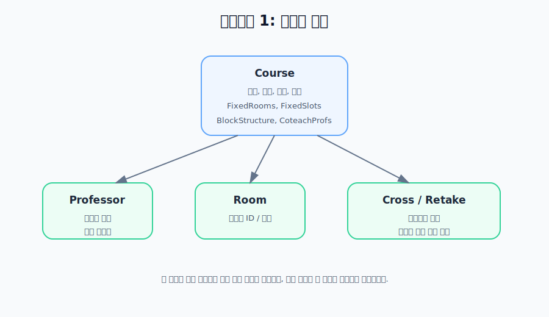
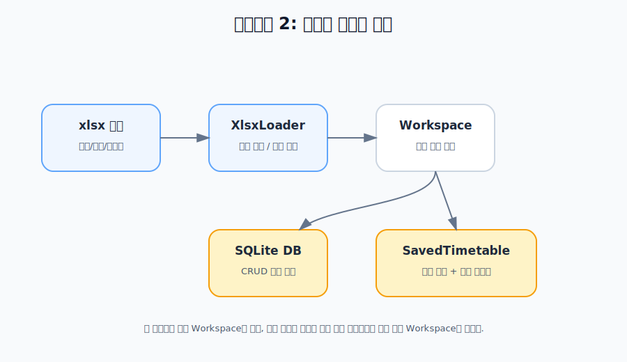
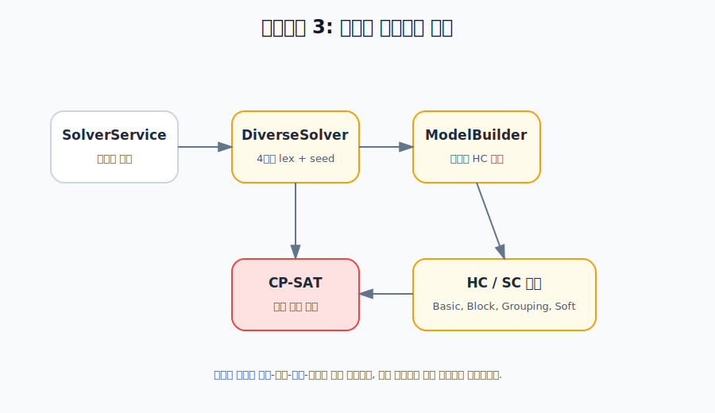
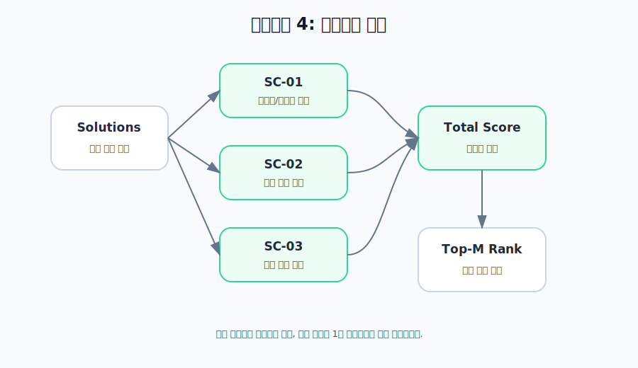
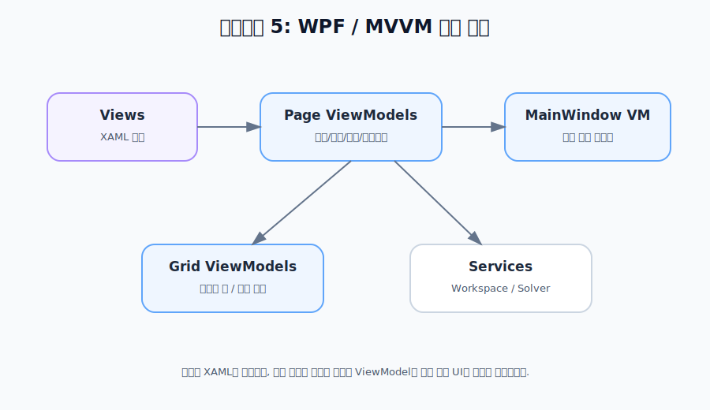
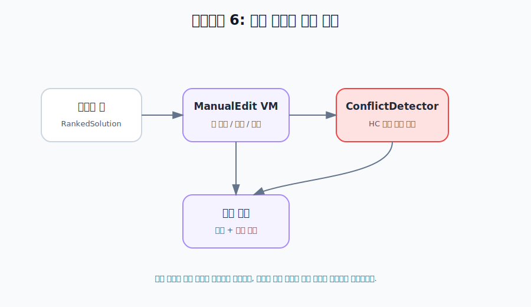
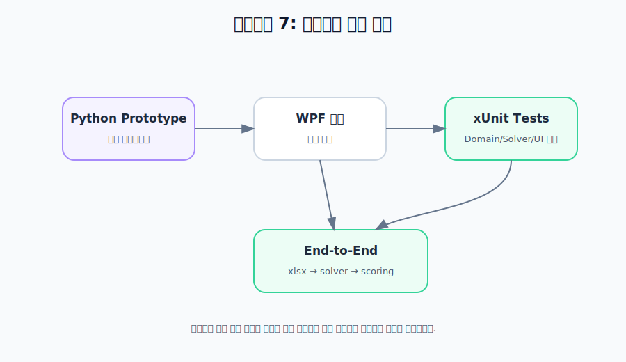

# 프로젝트 개요와 개발 구성요소

이 문서는 전공 시간표 자동 편성 프로젝트의 개발 내용을 발표나 보고서에 넣기 좋게 구성요소별로 정리한 자료입니다. 각 구성요소는 “무엇을 만들었는지”, “왜 필요한지”, “어디에 구현되어 있는지”를 중심으로 설명합니다.

## 1. 프로젝트 개요

이 프로젝트는 대학 학과의 전공 강의 시간표를 자동으로 편성하는 시스템입니다. 과목, 교수, 강의실, 분반, 고정 시간, 재수강 조건 같은 입력을 받아서, 충돌이 없는 시간표 후보를 여러 개 생성하고 점수순으로 보여줍니다.

핵심 목표는 다음과 같습니다.

| 목표 | 설명 |
|---|---|
| 자동 편성 | 사람이 직접 맞추기 어려운 시간표를 제약 충족 방식으로 생성 |
| 제약 반영 | 강의실 중복, 교수 중복, 학년 중복, 점심 시간 금지, 고정 시간/방 등 반영 |
| 선호도 반영 | 월요일 오전·금요일 오후 회피, 교수 요일 집중, 블록 간격 같은 소프트 조건 반영 |
| 다양한 후보 제공 | 하나의 답만이 아니라 여러 후보를 만들고 점수로 비교 |
| 수동 보정 | 생성된 시간표를 사람이 수정하고 충돌 여부를 확인 |

## 2. 개발 구성요소 요약

| 구성요소 | 한 줄 설명 | 대표 구현 |
|---|---|---|
| 도메인 모델 | 시간표 문제를 표현하는 데이터 구조 | `TimetableScheduler.Domain` |
| 데이터 입력과 저장 | xlsx 편람을 읽고 SQLite에 저장 | `TimetableScheduler.Data` |
| 자동생성 엔진 | CP-SAT으로 시간표 후보 생성 | `TimetableScheduler.Solver` |
| 점수화와 랭킹 | 생성된 후보를 SC 점수로 정렬 | `TimetableScheduler.Scoring` |
| WPF / MVVM UI | 사용자 화면과 상태 관리 | `TimetableScheduler.Wpf`, `TimetableScheduler.ViewModel` |
| 수동 편집과 검증 | 생성 결과를 사람이 수정하고 충돌 확인 | `ManualEditViewModel`, `ConflictDetector` |
| 테스트와 회귀 검증 | 기능 동작과 포팅 안정성 확인 | `TimetableScheduler.Tests`, `prototype-py` |

---

## 구성요소 1. 도메인 모델



도메인 모델은 시간표 문제를 코드가 이해할 수 있는 형태로 바꾸는 부분입니다. 이 계층은 화면, DB, OR-Tools에 직접 의존하지 않는 순수 모델입니다.

| 모델 | 담고 있는 정보 |
|---|---|
| `Course` | 과목 코드, 이름, 학년, 시수, 전필/전선, 담당 교수, 분반, 고정 방, 고정 시간, 블록 구조, 팀티칭 교수 |
| `Professor` | 교수 ID, 이름, 불가능 시간, 허용 강의실 |
| `Room` | 강의실 ID, 이름 |
| `CrossGroup` | 교차수강 처리가 필요한 과목 묶음 |
| `RetakeScenario` | 재수강자가 들을 수 있어야 하는 안전 분반 조건 |

대표 구현 파일:

- `wpf/TimetableScheduler.Domain/Course.cs`
- `wpf/TimetableScheduler.Domain/Professor.cs`
- `wpf/TimetableScheduler.Domain/DomainHelpers.cs`

주요 개발 내용:

- 분반이 여러 개인 과목을 개별 과목으로 확장하는 로직 구현
- 대표 교수와 팀티칭 교수를 함께 다룰 수 있는 교수 ID 계산 로직 구현
- 상위 학년 재수강 시나리오를 자동 도출하는 로직 구현

---

## 구성요소 2. 데이터 입력과 저장



데이터 계층은 외부 입력을 앱 내부 모델로 바꾸고, 사용자가 수정한 데이터를 저장합니다.

대표 구현 파일:

- `wpf/TimetableScheduler.Data/XlsxLoader.cs`
- `wpf/TimetableScheduler.Data/SqliteRepository.cs`
- `wpf/TimetableScheduler.Data/AppData.cs`
- `wpf/TimetableScheduler.ViewModel/WorkspaceService.cs`

주요 개발 내용:

| 기능 | 설명 |
|---|---|
| xlsx 로딩 | 강좌 편람에서 과목, 교수, 강의실 정보를 읽음 |
| 블록 구조 추론 | 3시수는 `[2,1]`, 4시수는 `[2,2]`처럼 기본 블록으로 변환 |
| SQLite 저장 | 과목·교수·강의실·교차수강·재수강 조건을 DB에 저장 |
| 즉시 영속화 | Workspace에서 CRUD가 발생하면 DB에 즉시 저장 |
| 저장된 시간표 | 생성 결과와 수동 편집 링크, 당시 제약 스냅샷을 함께 저장 |

이 구성요소의 핵심은 `WorkspaceService`입니다. 화면은 Workspace를 보고 수정하고, 솔버는 Workspace의 스냅샷을 받아 계산합니다.

---

## 구성요소 3. 시간표 자동생성 엔진



자동생성 엔진은 프로젝트의 핵심입니다. 시간표 문제를 OR-Tools CP-SAT 모델로 만들고, 제약을 만족하는 시간표 후보를 찾습니다.

대표 구현 파일:

- `wpf/TimetableScheduler.Solver/ModelBuilder.cs`
- `wpf/TimetableScheduler.Solver/DiverseSolver.cs`
- `wpf/TimetableScheduler.Solver/BasicHcs.cs`
- `wpf/TimetableScheduler.Solver/BlockHcs.cs`
- `wpf/TimetableScheduler.Solver/GroupingHcs.cs`
- `wpf/TimetableScheduler.Solver/SoftConstraints.cs`

주요 개발 내용:

| 영역 | 설명 |
|---|---|
| 결정 변수 설계 | 과목×요일×교시×강의실 변수 `x`, 시간 점유 변수 `y`, 블록 시작 변수 설계 |
| 하드 제약 구현 | 강의실·교수·분반·학년 충돌 방지, 점심 금지, 고정 시간/방, 재수강, 교차수강 등 |
| 소프트 제약 구현 | SC-01/02/03 조건을 패널티로 계산 |
| 4단계 lex 최적화 | SC-01 → SC-02 → SC-03 순서로 제한시간 내 목적값을 구하고 bound로 잠금 |
| 다양한 해 생성 | random seed loop와 중복 제거로 여러 후보 생성 |
| 진행/취소 지원 | `IProgress<SolverProgress>`와 `CancellationToken`으로 UI와 연결 |

자동생성 엔진의 출력은 `SolutionAssignment` 목록입니다.

```text
CourseId + Day + Period + RoomId
```

즉, “어떤 과목이 어느 요일, 어느 교시, 어느 강의실에 배치되었는지”를 나타내는 결과입니다.

---

## 구성요소 4. 점수화와 랭킹



솔버가 만든 후보는 모두 HC를 만족하는 시간표입니다. 그중 어떤 시간표가 더 좋은지 비교하기 위해 점수화가 필요합니다.

대표 구현 파일:

- `wpf/TimetableScheduler.Scoring/SolutionScoring.cs`

현재 점수 항목:

| 항목 | 좋은 시간표의 기준 | 표시 점수 의미 |
|---|---|---|
| SC-01 | 월요일 오전, 금요일 오후 수업이 적음 | 1에 가까울수록 특수 시간 회피 성공 |
| SC-02 | 교수별 수업 요일이 3일 이하로 집중됨 | 1에 가까울수록 교수 일정이 집중됨 |
| SC-03 | 같은 과목의 블록 요일 차 선호 | 1에 가까울수록 블록 요일 차가 2에 가까움 |

현재 총점은 세 점수의 합입니다.

```text
Total = SC01 + SC02 + SC03
```

결과 화면에서는 이 총점을 기준으로 후보를 정렬하고, 상위 후보를 보여줍니다.

---

## 구성요소 5. WPF / MVVM UI



UI는 WPF XAML 화면과 ViewModel로 나뉩니다. 화면은 보여주는 역할을 하고, 실제 상태와 명령은 ViewModel이 담당합니다.

대표 구현 파일:

- `wpf/TimetableScheduler.Wpf/Views/*`
- `wpf/TimetableScheduler.ViewModel/Pages/MainWindowViewModel.cs`
- `wpf/TimetableScheduler.ViewModel/Pages/DataInputViewModel.cs`
- `wpf/TimetableScheduler.ViewModel/Pages/ResultsViewModel.cs`
- `wpf/TimetableScheduler.ViewModel/Grid/TimetableGridViewModel.cs`
- `wpf/TimetableScheduler.ViewModel/Grid/UnifiedTimetableViewModel.cs`

화면 구성:

| 화면 | 역할 |
|---|---|
| 시간표 선택 | 새 시간표 생성 또는 기존 시간표 편집 선택 |
| 정보 입력 | 교수·과목·강의실·솔버 옵션 입력 |
| 해 미리보기 | 생성된 후보를 통합/학년/강의실/교수별로 확인 |
| 수동 편집 | 선택한 시간표를 사람이 수정하고 저장 |

UI와 솔버는 직접 연결되지 않습니다. 정보 입력 화면에서 `SolverService`를 호출하고, 결과는 ViewModel에 저장된 뒤 화면에 렌더링됩니다.

---

## 구성요소 6. 수동 편집과 충돌 검증



자동생성 결과가 항상 사용자의 최종 의도와 완전히 일치하지는 않을 수 있습니다. 그래서 생성된 해를 사람이 직접 수정할 수 있는 수동 편집 흐름이 있습니다.

대표 구현 파일:

- `wpf/TimetableScheduler.ViewModel/Pages/ManualEditViewModel.cs`
- `wpf/TimetableScheduler.Solver/ConflictDetector.cs`
- `wpf/TimetableScheduler.Solver/TimetableRuns.cs`

주요 개발 내용:

| 기능 | 설명 |
|---|---|
| 선택 해 편집 | 결과 화면에서 선택한 후보를 수동 편집으로 전달 |
| 통합 시간표 기반 조작 | 학년별 컬럼이 나뉜 통합 시간표에서 셀 단위 편집 |
| 충돌 감지 | 강의실 중복, 교수 중복, 점심 배치, 분반/학년 충돌 등을 감지 |
| 저장 | 수정된 시간표와 수동 교차 링크를 저장 |

현재 수동 편집은 재솔버를 호출하지 않고, 사람이 조정한 배치를 검증하고 저장하는 구조입니다.

---

## 구성요소 7. 테스트와 회귀 검증



프로젝트는 Python 프로토타입에서 WPF 본 제품으로 포팅되었기 때문에, 기존 동작을 유지하는지 확인하는 회귀 검증이 중요합니다.

대표 위치:

- `prototype-py/`
- `wpf/TimetableScheduler.Tests/`

테스트 영역:

| 영역 | 검증 내용 |
|---|---|
| Domain | 분반 확장, 재수강 조건 도출 |
| Data | xlsx 로딩, SQLite 저장, 저장 시간표 |
| Solver | CP-SAT 모델 생성, HC 동작, 다양한 해 생성 |
| Scoring | SC 점수와 랭킹 계산 |
| ViewModel | 화면 상태, 격자 렌더링, 수동 편집 흐름 |
| Integration | xlsx 입력부터 솔버 결과까지 종단간 확인 |

테스트는 단순히 빌드가 되는지 보는 것이 아니라, 실제 시간표 생성 흐름이 유지되는지 확인하는 역할을 합니다.

## 발표용 구성 설명 예시

발표나 문서에서 짧게 설명할 때는 다음 문장 구조를 사용할 수 있습니다.

> 본 프로젝트는 전공 강의 시간표를 제약 충족 문제로 모델링하여 자동으로 편성하는 WPF 애플리케이션입니다. 과목, 교수, 강의실, 고정 시간, 재수강 조건을 도메인 모델로 관리하고, OR-Tools CP-SAT 기반 솔버가 하드 제약을 만족하는 시간표 후보를 생성합니다. 생성된 후보는 소프트 제약 점수로 랭킹되며, 사용자는 결과를 확인한 뒤 수동 편집과 충돌 검증을 통해 최종 시간표를 저장할 수 있습니다.

## 구성요소별 산출물 정리

| 구성요소 | 산출물 |
|---|---|
| 도메인 모델 | 시간표 문제를 표현하는 C# 클래스 |
| 데이터 입력과 저장 | xlsx 로더, SQLite 저장소, 저장 시간표 스냅샷 |
| 자동생성 엔진 | CP-SAT 모델, HC/SC 구현, 다양한 해 생성기 |
| 점수화와 랭킹 | SC 점수 함수, Top-M 정렬 |
| WPF / MVVM UI | 4단계 화면, 시간표 격자, 사이드바 입력 UI |
| 수동 편집과 검증 | 시간표 수정 흐름, 충돌 감지 카드 |
| 테스트와 회귀 검증 | 단위 테스트, 통합 테스트, Python 베이스라인 비교 |
